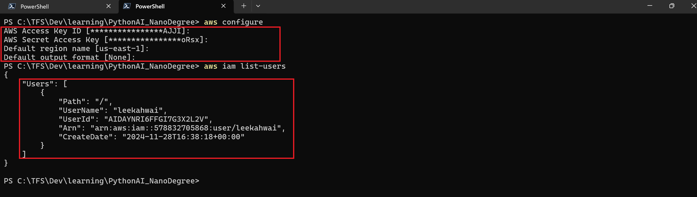
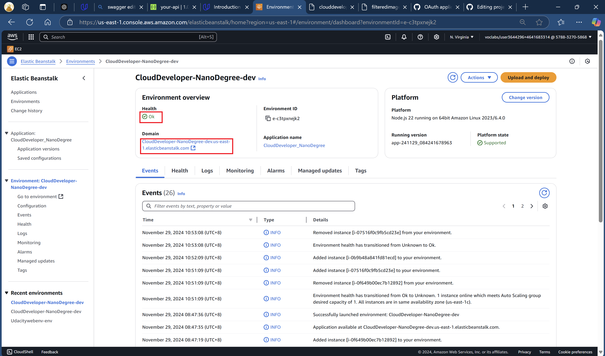

# Udacity Cloud Developer NanoDegree Project #2
## Image Processing Microservice on AWS

1. Intention
The project intends to equip student the knowledge of creating a microservice endpoint illustrating through NodeJS.
And also a microservice platform such as elastic beanstalk to simply deployment.

2. Procedure:

i. I started by editing the server.js to create the filterimage endpoint. 
Also to ensure that the error code according to Rubric requirements are met.  HTTP 200 and 422 responses. 

ii. I also modified util.js to include axios as for some reasons, the buffer from the original code cannot be read with just the url.
I also need to make sure that the nodejs packages needs to be installed using npm install command. 

iii. To test the application locally before uploading to elastic beanstalk, I need to invoke the "npm run start" command. 
This shall invoke the nodejs microservice locally at port 8082

iv. Verify that the microservice is working in the local machine using the brower.

v. Setup IAM

vi. Setup AWS CLI and EB CLI based on IAM keys

vii. Initialise and Create an elastic beanstalk

viii. Verify from dashboard that the elastic beanstalk is setup properly

ix. Verify that microservice now works on AWS

x. Test using curl that the http endpoint meets the response code correctly

4
